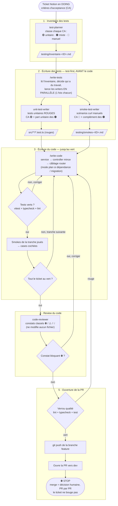

# Workflow d'un ticket backend — de l'inventaire à la PR

Le déroulé complet d'un ticket (ex. BE01), tel qu'il est outillé dans ce repo, en cinq
étapes. **Chaque étape a exactement un point d'entrée** — un subagent d'inventaire, un skill
qui orchestre les deux writers test-first, un skill d'écriture du code jusqu'au vert, un
subagent de review, puis l'ouverture de la PR vers `dev`.

## Vue d'ensemble

## Les phases en détail

### 1. Inventaire des tests

Le subagent `test-planner` prend le lien du ticket et classe chaque CA :

| État | Sens | Vérifié par |
|---|---|---|
| 🟢 | ce qu'on vérifie est du code à nous (validation, transformation, mapping d'erreur) | test unitaire, dépendances mockées |
| 🟠 | une tranche à nous (unitaire) + une tranche réelle qu'aucun smoke ne couvre | test unitaire **et** smoke manuel |
| 🔴 | ce qu'on vérifie est le comportement réel d'une dépendance et son branchement | smoke manuel uniquement |

Sortie : `testing/inventaire-<TICKET_ID>.md`. C'est lui qui fixe le périmètre des deux
subagents test-first, qui peuvent tourner **en parallèle** (périmètres disjoints).

### 2. Écriture des tests (test-first, avant toute implémentation)

**Tous les tests du ticket sont écrits d'un coup, avant la moindre ligne de code** — pas
paquet par paquet. Deux raisons : l'implémentation a besoin de voir la **spec complète de
chaque fonction** pour l'écrire en une fois (sinon on retombe sur les valeurs de
remplissage décrites à l'étape 3), et les tests se dérivent du ticket et du contrat, qui
sont déjà tranchés — il n'y a rien à apprendre de l'implémentation pour les écrire.

Point d'entrée unique : le skill **`/write-tests`**. Il lit l'inventaire, décide lesquels
des deux writers ont du travail (un ticket sans 🔴 ni 🟠 ne lance pas le smoke-writer), et
les lance **en parallèle, une seule fois chacun** — leurs fichiers sont disjoints. Il
n'écrit lui-même aucun test.

- `unit-test-writer` écrit les tests unitaires des CA 🟢 et de la part
  unitaire des 🟠. Ils sont **rouges par construction** : l'implémentation n'existe pas.
- `smoke-test-writer` écrit les scénarios manuels (préconditions, étapes curl,
  résultat attendu) des CA 🔴 et du complément des 🟠, dans
  `testing/smokes-<TICKET_ID>.md` — une case à cocher par scénario.

Deux writers plutôt qu'un seul, parce que le découpage suit l'axe où le travail diffère
vraiment — **le type de test** : l'un mocke et isole du code exécutable, l'autre rédige une
checklist pour un humain. `integration-test-writer` et `e2e-test-writer` prendront leur
place sur le même axe le jour venu.

Les deux fichiers jouent le même rôle : fixer le cahier des charges (endpoints, formes
de réponse, codes HTTP) avant d'écrire le code.

### 3. Écriture du code, jusqu'au vert

`/write-code` fait passer au vert les tests rouges écrits à l'étape 2. Le cahier des
charges, ce sont eux ; à défaut, les smokes + le ticket — rien de plus, rien de moins.

- **Décision structurante** (nouvelle dépendance, migration Prisma, fichier hors des
  couches) → mode plan d'abord, exécution après accord.
- L'implémentation suit les couches du repo : `services/` (logique pure) →
  `controllers/` (minces) → `routes/` (aucun corps de handler), câblage dans
  `routes/index.ts`.

**On n'impose pas de découpage à cette étape**, et c'est délibéré. Les paquets du ticket
groupent les CA **par thème**, alors que le code groupe **par fonction** : `toApiError`
sert des CA de trois paquets différents. Imposer la frontière du paquet à l'implémentation
force à n'écrire que la moitié d'une fonction, donc à boucher le trou avec une valeur de
remplissage — puis à revenir la démonter au paquet suivant. C'est exactement ce qui a
produit le `status: 0` sur BE01.

Comme tous les tests rouges existent déjà, l'unité se lit d'elle-même : on ouvre un
fichier de test, on écrit la fonction **en entier**, on passe au suivant. Rien à
prescrire, rien à anticiper.

**Vérification, à chaque tranche :**

- Tests verts (`pnpm vitest run`) — ou, pour du code sans tests unitaires (le branchement
  d'une dépendance, un middleware) : serveur qui démarre et route montée qui répond.
- `pnpm typecheck`.
- `pnpm lint` — garanti par le **hook Stop** (`.claude/settings.json`) : à chaque fin de
  tour de l'agent, le harnais lance le lint et bloque (exit 2) tant qu'il y a des erreurs.
- Les smokes correspondants sont exécutés (par l'utilisateur, ou par l'agent sur demande
  explicite) et leurs cases cochées. **Les jouer au fil de l'eau, pas tous à la fin** :
  c'est le seul moyen de découvrir tôt qu'un mock ne correspond pas à la réalité, avant
  d'avoir écrit trois autres mappings sur la même hypothèse fausse (cf. CA9 de BE01).

Quand toute la suite est verte et les smokes cochés, on passe à la review.

### 4. Review du code

Le subagent `code-reviewer` relit le diff complet de la branche. Il **ne modifie
aucun fichier** : il rend une revue classée par gravité, chaque constat préfixé de son
marqueur — ⛔ bloquant, ⚠️ à corriger, 💡 suggestion — avec l'emplacement `chemin:ligne`,
le mécanisme concret et une correction proposée. Un constat ⛔ renvoie à l'implémentation ;
sinon on ouvre la PR.

### 5. Ouverture de la PR

Le skill `/open-pr` amène le travail jusqu'à la PR, **sans merger** :

1. **Verrou qualité** bloquant : `pnpm lint`, `pnpm typecheck`, `pnpm test`. Au premier
   rouge, on s'arrête — rien n'est poussé.
2. `git push` de la branche feature.
3. **PR ouverte vers `dev`** (pas `main`), corps dérivé des commits.
4. **STOP.** Le merge vers `dev` est une décision humaine explicite, donnée pour cette PR
   précise (rule Git du repo) — il n'est pas dans le périmètre du skill.

> **Le ticket ne bouge pas à cette étape.** Tant que rien n'est mergé ni déployé, il n'y a
> rien à tester : le ticket reste en `DOING`. Il passera en `TESTING` après le merge **et**
> le déploiement — c'est aussi à ce moment-là que le lien de test est posé en commentaire,
> sur le ticket user-facing. Ce déplacement est manuel pour l'instant ; il reviendra à
> l'étape de déploiement, qui n'est pas encore outillée.

## Ce que chaque phase produit

| Phase | Livrable |
|---|---|
| Inventaire | `testing/inventaire-<ID>.md` |
| Écriture des tests | `src/**/*.test.ts` (rouges) + `testing/smokes-<ID>.md` |
| Écriture du code | code sous `src/`, migrations sous `prisma/migrations/`, suite verte, cases smoke cochées |
| Review | revue classée ⛔ / ⚠️ / 💡 (aucun fichier modifié) |
| Ouverture de la PR | PR ouverte vers `dev` (le ticket ne bouge pas) |
